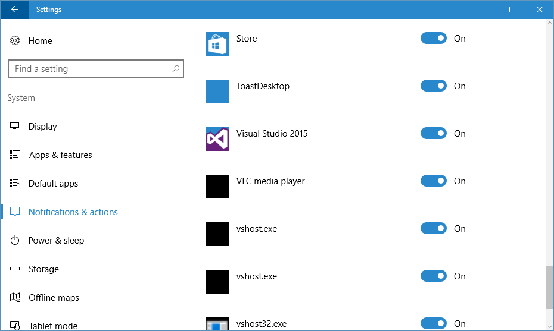
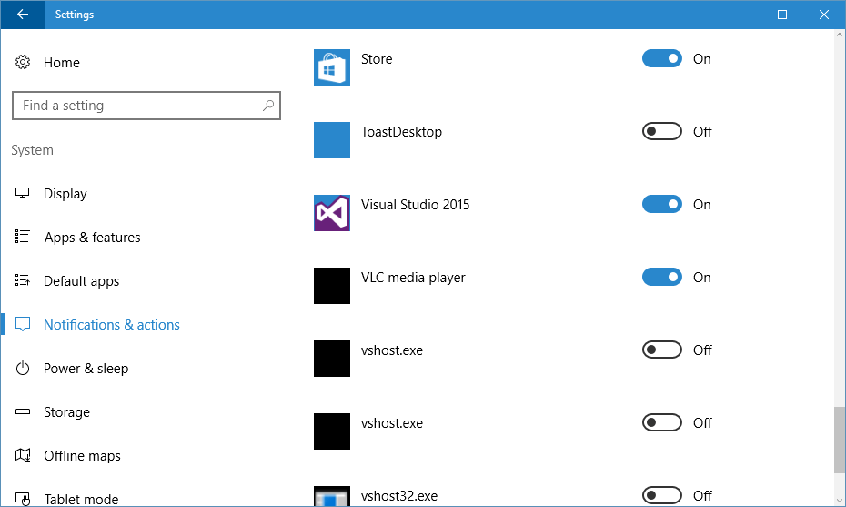
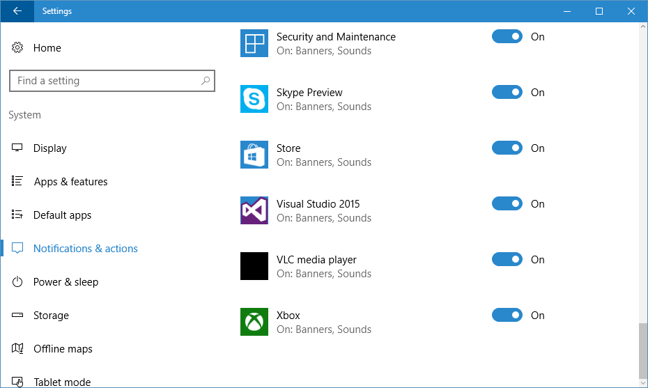

# Notification Senders Cleanup Utility
Testing lots of programs or developing your own can quickly fill up the list of notification senders in the Windows 10 Settings app with unwanted entries. This script can help you remove them.

Most likely, the script requires Windows 10 version 1511 or newer. If I remember correctly, it was in that version the notification list was moved from the registry to a SQLite database.

## Setup
Before running the script, download [System.Data.SQLite](http://system.data.sqlite.org/index.html/doc/trunk/www/downloads.wiki) and extract the downloaded file into the Bin directory.

The script has been tested with the **non-bundle** version found under **Precompiled Statically-Linked Binaries for 64-bit Windows (.NET Framework 4.0)**.

## Removing senders
Open the Settings app and click System / Notifications & actions.

Look through the list of notification senders and decide which senders you want to remove.

Disable the senders you want to remove. If you have disabled senders you want to keep, temporarily enable them while running the script.

Run the script and reopen Notification & actions to see the result.

Redisable any temporarily enabled senders.

## Limitations
While researching the problem, I stumbled across information stating that the live tile system could be permanently damaged by removing Universal Windows Apps from the sender list.
The script has therefore been written to leave Universal Apps alone and to only remove ordinary desktop applications.

If you want to take a chance and remove a Universal App, remove `AND NotificationHandler.HandlerType = 'app:desktop'` from the end of the first SQL query in the script.

## Missing data
The data deleted by the script does not contain the path of the sender executable.
This leads me to believe that some unwanted data is left on the system.
If you know where to find the missing data, feel free to contact me or better yet, send a pull request :wink:
